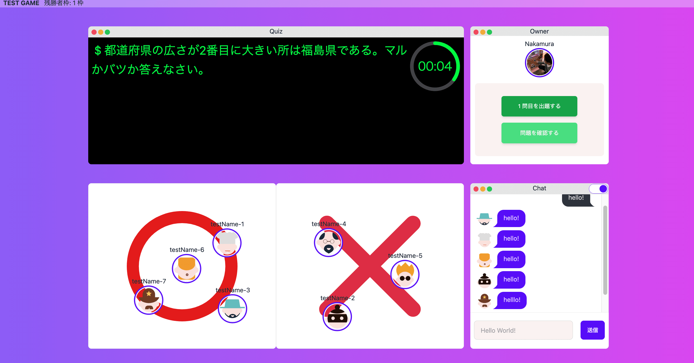

# ○×クイズオンライン



○×クイズオンラインというサービスは、複数人でオンライン上で集まって○×クイズが遊べるパーティーゲームです。  
ユーザーはブラウザ上で自分のアバターを○エリア、✗エリアに移動させることによって回答ができます。  
チャットなどで○や✗を発言するのと違って、誰が、どれくらいの人数が、○または✗と答えているか、また回答に迷っている様子がリアルタイムで見れる機能が備わっていることが特徴です。  

[○×クイズオンライン](https://www.marubatsu-quiz-online.com)
## 開発環境
### バックエンド
- Ruby 3.2.2
- Ruby on Rails 7.0.5

### フロントエンド
- Nuxt.js 3.5.2
- TypeScript
- Tailwind CSS
- daisyUI

### インフラ
- [fly.io](https://fly.io/)
- [vercel](https://vercel.com/)

### 環境構築
- Docker
- Docker Compose

### テスト
- RSpec
- Vitest
- Cypress

### 外部サービス
- [SkyWay](https://skyway.ntt.com/ja/)
- [Firebase Authentication](https://firebase.google.com/?hl=ja)

## 開発環境構築
### クローン
```
$ git clone https://github.com/keiz1213/maru-batsu-quiz.git
$ cd maru-batsu-quiz/
```
### 環境変数
ルートディレクトリで以下のように`.env`に環境変数を設定してください
```
$ touch .env
```
```
# common
CONTAINER_PORT=3000
API_PORT=3000
FRONT_PORT=8080

# firebase
FIREBASE_API_KEY=<firebase-api-key>
FIREBASE_AUTH_DOMAIN=<firebase-auth-domain>
FIREBASE_PROJECT_ID<firebase-project-id>

# skyway
SKYWAY_ID=<skyway-id>
SKYWAY_SECRET=<skyway-secret>
```
[SkyWay](https://skyway.ntt.com/ja/)  
[Firebase Authentication](https://firebase.google.com/?hl=ja)
### 起動
※Docker、docker-composeが必要になります
```
$ docker-compose build
$ docker-compose run --rm front npm install
$ docker-compose run --rm api bin/rails db:create
$ docker-compose run --rm api bin/rails db:migrate
$ docker-compose up
```

## テスト
### Cypressでテストを行うために`front`ディレクトリに以下のファイルを作成してください

 cypress.env.json
```
{
  "FIREBASE_API_KEY": "<firebase-api-key>",
  "FIREBASE_AUTH_DOMAIN": "<firebase-auth-domain>",
  "FIREBASE_PROJECT_ID": "<firebase-project-id>",
  "TEST_UID": "<test-uid>"
}
```
serviceAccount.json
```
{
  "type": "<type>",
  "project_id": "<project-id>",
  "private_key_id": "<private-key-id>",
  "private_key": "<private-key>",
  "client_email": "<client-email>",
  "client_id": "<client-id>",
  "auth_uri": "<auth-uri>",
  "token_uri": "<token-uri>",
  "auth_provider_x509_cert_url": "<auth-provider-x509-cert-url>",
  "client_x509_cert_url": "<client-x509-cert-url>",
  "universe_domain": "<universe-domain>"
}
```
[Firebase Authentication](https://firebase.google.com/?hl=ja)
### バックエンド
```
$ docker-compose run --rm api bundle exec rspec
```
### フロントエンド
#### 単体テスト
```
$ docker-compose run --rm npm run test:unit
```
#### E2Eテスト
```
$ docker-compose up
$ cd front
$ npm run test:e2e
```
## リント・フォーマッター
### バックエンド
```
$ docker-compose run --rm api bundle exec rubocop
```
### フロントエンド
```
$ docker-compose run --rm npm run lint
```
